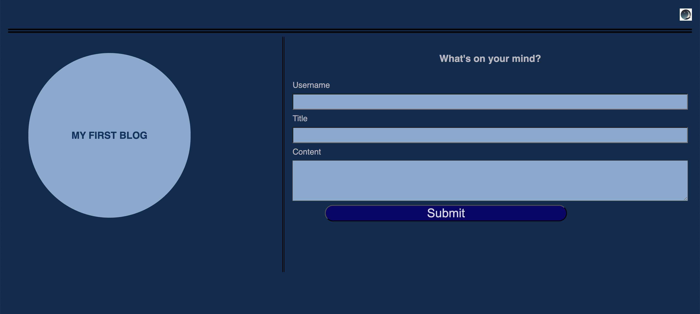
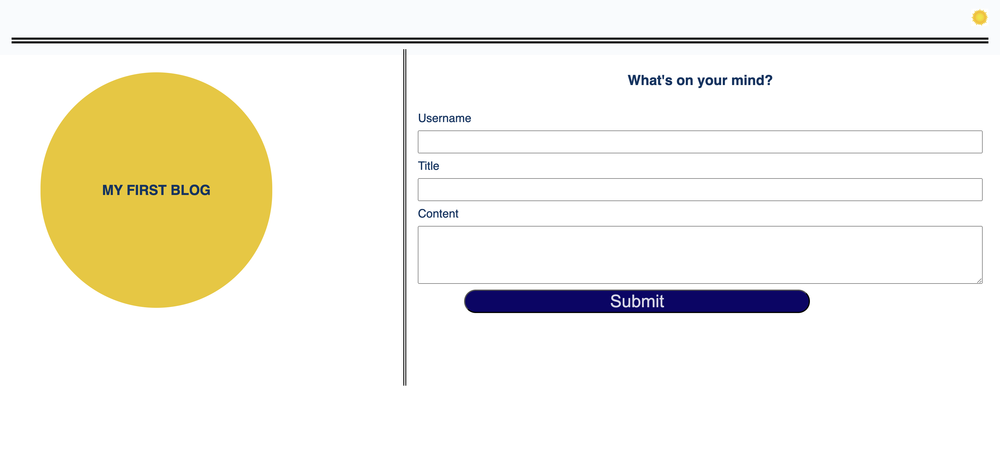
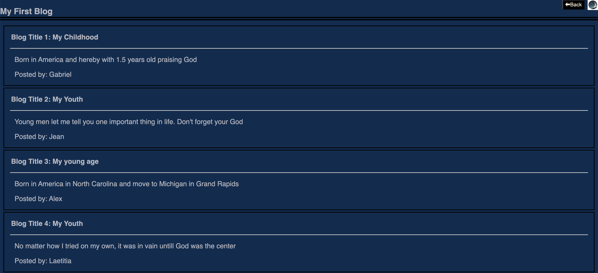
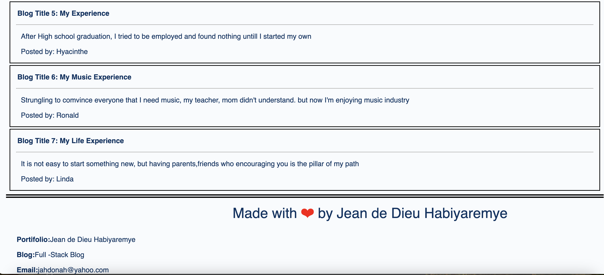

# Jean-de-dieu-blog
## Description
```md 
This is a two-page website where users will input and view blog posts. It includes building a content form, dynamically rendering blog posts, and implementing a light/dark mode toggle.
```

## Installation
```md
This Web Application will be hosted 
and will not require any installation. 
The clients will require to have a digital device 
that have a browser such as google Chrome, 
Mozilla firefox and so on.

```
## User Story

```md
AS A marketing student,
I WANT a personal blog
SO THAT I can showcase my thoughts and experiences.
```

## Usage
To use this website :
* GIVEN a personal blog
* WHEN I load the app,
* THEN I am presented with the landing page containing a form with labels and inputs for username, blog title, and blog content.
* WHEN I submit the form,
* THEN blog post data is stored to localStorage.
* WHEN the form submits,
* THEN I am redirected to the posts page.
* WHEN I enter try to submit a form without a username, title, or content,
* THEN I am presented with a message that prompts me to complete the form.

## Mock-Up

The following images show the web application's appearance and functionality:

Shows the blog input in dark mode


Shows the blog input in light mode


Shows the blog display in dark mode


Shows the blog display in light mode


## Link of Deployed Application
 Link: [`Jean de Dieu Blog`](https://jahdona.github.io/Jean-de-dieu-blog/)

## Credits

N/A

## License

This website uses the license of MTI